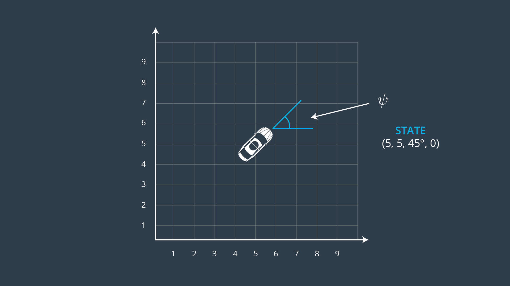

# CarND-Controls-MPC
Self-Driving Car Engineer Nanodegree Program

---

## Model Implementation

The model used in the implementation is the Kinematic Model from Udacity Course.

Kinematic models are simplifications of dynamic models that ignore tire forces, gravity, and mass. The accuracy of the model is reduced but it is also more tractable. As the simulation was done in fairly low speeds, kinematic models often approximate the actual vehicle dynamics.

The kinematic model is based on the following state [x,y,ψ,v].



On top of the 4 states mentioned, additional cross track error (cte) and bearing difference wrt waypoints (epsi) were also added to give the final state of [x,y,ψ,v,cte,epsi].

For actuation, [δ,a] where δ represents steering and a represents throttle are output. Both these values are limited [-1,1].

In terms of update equations, the following equations were use to update [x,y,ψ,v,cte,epsi]

```
x_[t+1] = x[t] + v[t] * cos(psi[t]) * dt
y_[t+1] = y[t] + v[t] * sin(psi[t]) * dt
psi_[t+1] = psi[t] + v[t] / Lf * delta[t] * dt
v_[t+1] = v[t] + a[t] * dt
cte[t+1] = f(x[t]) - y[t] + v[t] * sin(epsi[t]) * dt
epsi[t+1] = psi[t] - psides[t] + v[t] * delta[t] / Lf * dt

```
One point to note here is that information passed from simulator is given in terms of map space and rotation have to be carried out to map the information to car space before utilizing the values for calculation.

Detailed explanation of the above equations and its derivation is based from Lesson 18: Vehicle Models and shall not be futher explained.

---

## Timestep Length and Elapsed Duration (N and dt)

### T Value

T value is the value taken by multiplying number of time steps (N) and time step (dt). T value therefore allows the vehicle to predict seconds into the future in terms of the route to take and this value should not be more than a few seconds as it will not make sense to predict beyond what it can see.

### Number of time steps N

The value of N is the major driver of computational cost of the Model Predictive Control. If there are more time steps to predict, the model will have to optimize the control inputs [δ,a] to fit more points while achieving lowest cost of error. 


### Time step dt

Model Predictive Control attempts to approximate a continues reference trajectory by means of discrete paths between actuations. Large dt results in less frequent actuations, and hence unable to accurately approximate a 
continuous reference trajectory. This is sometimes called "discretization error".


At a speed of 40MPH, N = 10 and dt = 0.05 with a forward looking time of 0.5seconds was found to be a good value to minimize computation resource while achieving a smooth driving. An earlier value of N = 25 and dt = 0.05 was used but was found to be more computationally intensive while achieving similar results to N =10.

---

## Polynomial Fitting and MPC Preprocessing

The simulator provides 6 waypoints in terms of `ptsx` and `ptsy`, the vehicle `x` and `y` map position, orientation `psi`and vehicle `speed`. These values are pass to the program in map space and hence each of these values have to be converted to vehicle space. When converted to vehicle space, it will result in vehicle `x`, `y` and `psi` values to be 0.

By converting to vehicle space and taking the vehicle as the origin, the values `x`, `y` and `psi` used in the optimization will be closer to 0 and hence likely result in faster optimization instead of working with large `x`, `y` and `psi` in map space.

`ptsx` and `ptsy` that have been converted to vehicle space are used for polynomial fitting and is used to compute cross track error and bearing error

```
double cte = polyeval(coeffs, 0);
double epsi = atan(coeffs[1]);
```

---

## Model Predictive Control with Latency

In a real car, an actuation command won't execute instantly due to delays in command propagation. This is known as latency. The value of a Model Predictive Controller compared to a PID controller is therefore its ability to adapt to the latency in the system. 

In the simulator, a delays of 100 milliseconds was introduced to simulate a more realistic environment. 

To overcome the latency issue, the following points were considered.

- To overcome the 100ms of latency, prediction have to look ahead by more than 100ms. In my case, a prediction that looks ahead by 500ms was used as mentioned in the above section to get the car onto the planned waypoints.
- dt was kept to small 50ms such that even with the 100ms latency, the same actuator and steering value input calculated was still relevant to get the vehicle back on track.
- Further tuning of weights for the cost function was also consider to prioritize for the vehicle what was more important in the optimization function. The final values were achieved by trial and error which i believe can be further improved for higher speeds
  - Weights for `cte` and `epsi` were given 2 to ensure vehicle was able to stay on track
  - Weight for velocity `v` was given 1 as liberty was given for the vehicle to accelerate/decelerate to stay on track
  - Weight for steering actuation was given 100 to limit the amount of steering input. Too small a value tended to result in oscillation as steering input was large.
  - Weight for accelerator actuation was given 1 to allow vehicle the liberty to accelerate or decelerate.
  - Weight for rate of steering actuation was given 100 to smoothen steering inputs
  - Weight for rate of acceleration was given 1 to allow vehicle the liberty to accelerate or decelerate.

---

## Results

[](https://youtu.be/92qAeBeYs_Q)
---

## Dependencies

* cmake >= 3.5
 * All OSes: [click here for installation instructions](https://cmake.org/install/)
* make >= 4.1
  * Linux: make is installed by default on most Linux distros
  * Mac: [install Xcode command line tools to get make](https://developer.apple.com/xcode/features/)
  * Windows: [Click here for installation instructions](http://gnuwin32.sourceforge.net/packages/make.htm)
* gcc/g++ >= 5.4
  * Linux: gcc / g++ is installed by default on most Linux distros
  * Mac: same deal as make - [install Xcode command line tools]((https://developer.apple.com/xcode/features/)
  * Windows: recommend using [MinGW](http://www.mingw.org/)
* [uWebSockets](https://github.com/uWebSockets/uWebSockets) == 0.14, but the master branch will probably work just fine
  * Follow the instructions in the [uWebSockets README](https://github.com/uWebSockets/uWebSockets/blob/master/README.md) to get setup for your platform. You can download the zip of the appropriate version from the [releases page](https://github.com/uWebSockets/uWebSockets/releases). Here's a link to the [v0.14 zip](https://github.com/uWebSockets/uWebSockets/archive/v0.14.0.zip).
  * If you have MacOS and have [Homebrew](https://brew.sh/) installed you can just run the ./install-mac.sh script to install this.
* [Ipopt](https://projects.coin-or.org/Ipopt)
  * Mac: `brew install ipopt --with-openblas`
  * Linux
    * You will need a version of Ipopt 3.12.1 or higher. The version available through `apt-get` is 3.11.x. If you can get that version to work great but if not there's a script `install_ipopt.sh` that will install Ipopt. You just need to download the source from the Ipopt [releases page](https://www.coin-or.org/download/source/Ipopt/) or the [Github releases](https://github.com/coin-or/Ipopt/releases) page.
    * Then call `install_ipopt.sh` with the source directory as the first argument, ex: `bash install_ipopt.sh Ipopt-3.12.1`. 
  * Windows: TODO. If you can use the Linux subsystem and follow the Linux instructions.
* [CppAD](https://www.coin-or.org/CppAD/)
  * Mac: `brew install cppad`
  * Linux `sudo apt-get install cppad` or equivalent.
  * Windows: TODO. If you can use the Linux subsystem and follow the Linux instructions.
* [Eigen](http://eigen.tuxfamily.org/index.php?title=Main_Page). This is already part of the repo so you shouldn't have to worry about it.
* Simulator. You can download these from the [releases tab](https://github.com/udacity/CarND-MPC-Project/releases).


## Basic Build Instructions


1. Clone this repo.
2. Make a build directory: `mkdir build && cd build`
3. Compile: `cmake .. && make`
4. Run it: `./mpc`.

## Tips

1. It's recommended to test the MPC on basic examples to see if your implementation behaves as desired. One possible example
is the vehicle starting offset of a straight line (reference). If the MPC implementation is correct, after some number of timesteps
(not too many) it should find and track the reference line.
2. The `lake_track_waypoints.csv` file has the waypoints of the lake track. You could use this to fit polynomials and points and see of how well your model tracks curve. NOTE: This file might be not completely in sync with the simulator so your solution should NOT depend on it.
3. For visualization this C++ [matplotlib wrapper](https://github.com/lava/matplotlib-cpp) could be helpful.

## Editor Settings

We've purposefully kept editor configuration files out of this repo in order to
keep it as simple and environment agnostic as possible. However, we recommend
using the following settings:

* indent using spaces
* set tab width to 2 spaces (keeps the matrices in source code aligned)

## Code Style

Please (do your best to) stick to [Google's C++ style guide](https://google.github.io/styleguide/cppguide.html).

## Project Instructions and Rubric

Note: regardless of the changes you make, your project must be buildable using
cmake and make!

More information is only accessible by people who are already enrolled in Term 2
of CarND. If you are enrolled, see [the project page](https://classroom.udacity.com/nanodegrees/nd013/parts/40f38239-66b6-46ec-ae68-03afd8a601c8/modules/f1820894-8322-4bb3-81aa-b26b3c6dcbaf/lessons/b1ff3be0-c904-438e-aad3-2b5379f0e0c3/concepts/1a2255a0-e23c-44cf-8d41-39b8a3c8264a)
for instructions and the project rubric.

## Hints!

* You don't have to follow this directory structure, but if you do, your work
  will span all of the .cpp files here. Keep an eye out for TODOs.

## Call for IDE Profiles Pull Requests

Help your fellow students!

We decided to create Makefiles with cmake to keep this project as platform
agnostic as possible. Similarly, we omitted IDE profiles in order to we ensure
that students don't feel pressured to use one IDE or another.

However! I'd love to help people get up and running with their IDEs of choice.
If you've created a profile for an IDE that you think other students would
appreciate, we'd love to have you add the requisite profile files and
instructions to ide_profiles/. For example if you wanted to add a VS Code
profile, you'd add:

* /ide_profiles/vscode/.vscode
* /ide_profiles/vscode/README.md

The README should explain what the profile does, how to take advantage of it,
and how to install it.

Frankly, I've never been involved in a project with multiple IDE profiles
before. I believe the best way to handle this would be to keep them out of the
repo root to avoid clutter. My expectation is that most profiles will include
instructions to copy files to a new location to get picked up by the IDE, but
that's just a guess.

One last note here: regardless of the IDE used, every submitted project must
still be compilable with cmake and make./
